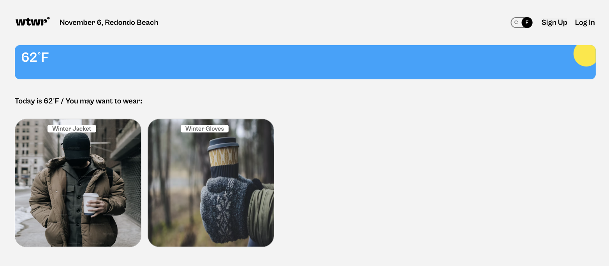
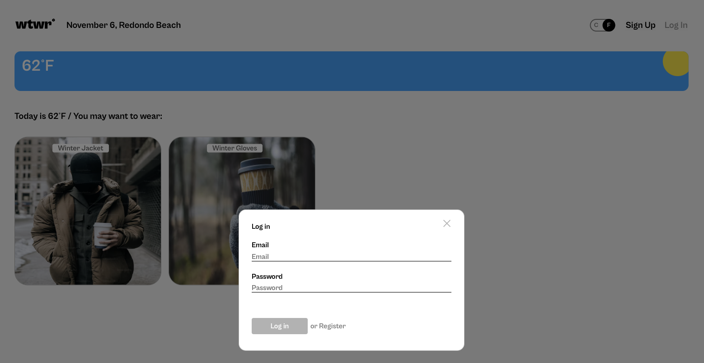
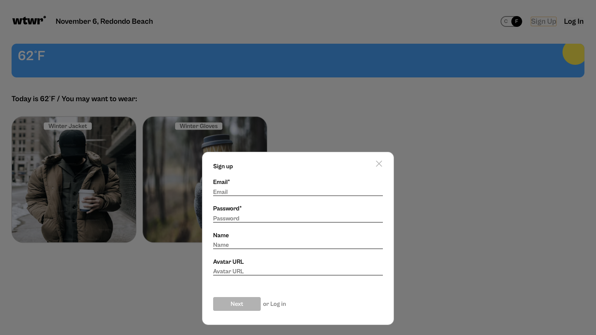
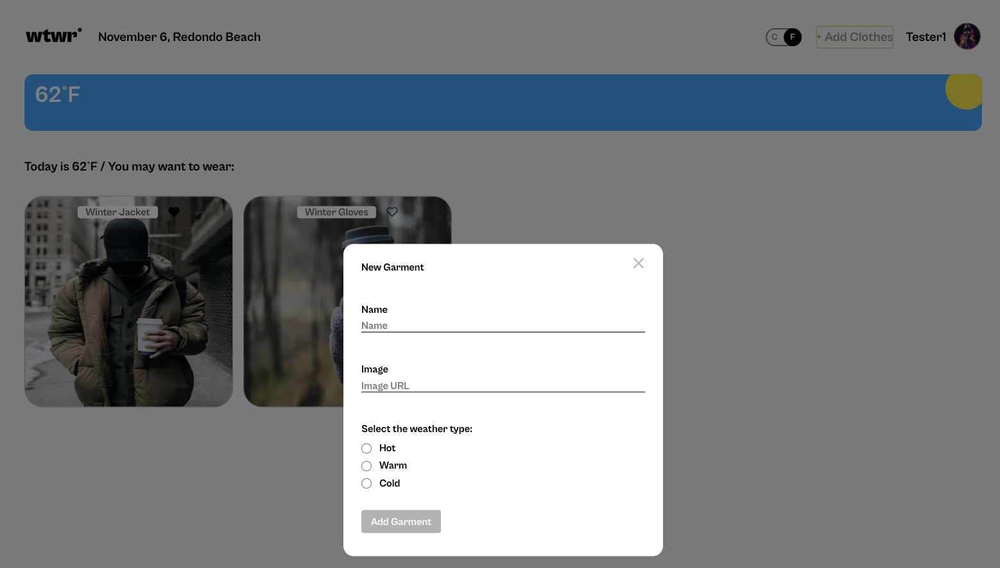
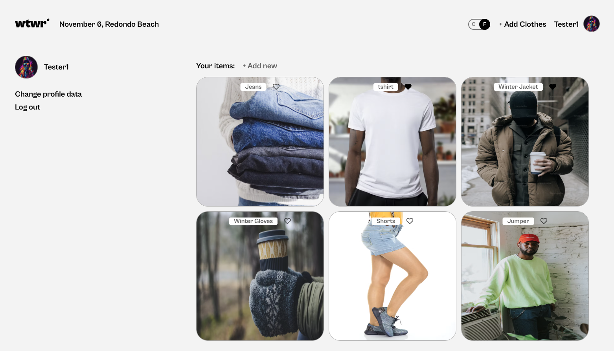
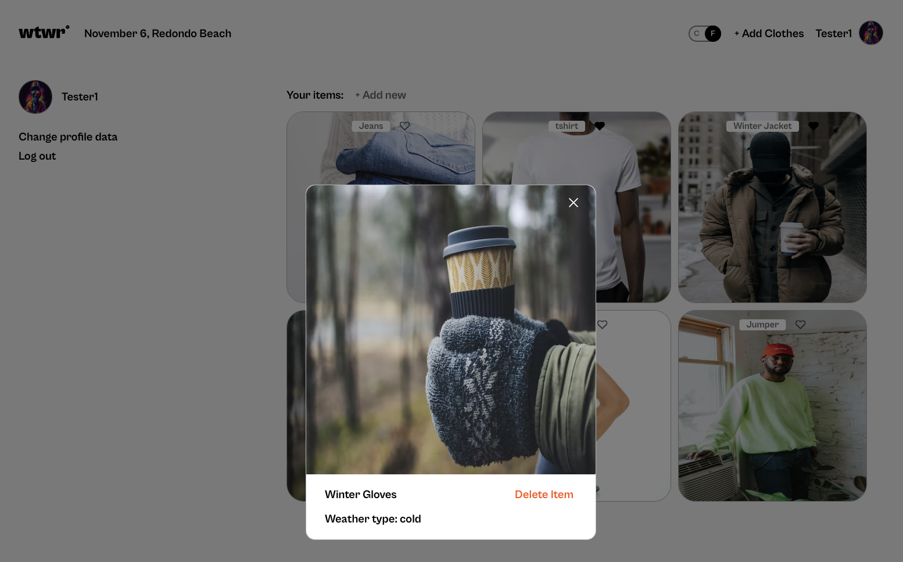
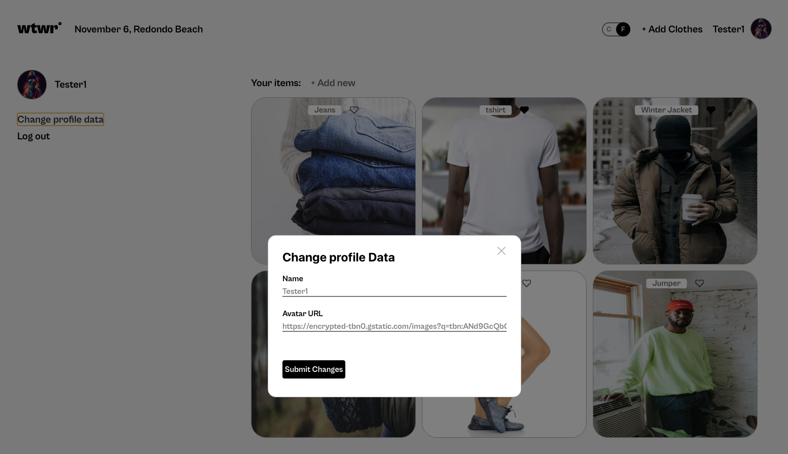

# WTWR (What to Wear?)

## About the project

The idea of the application is pretty simple - we make a call to an API, which then responds with the daily weather forecast. We collect the weather data, process it, and then based on the forecast, we recommend suitable clothing to the user.

## Screeshot

Home Page

Login at Home Page

Signup at Home Page

Add Clothes at Home Page

Profile Page

Preview Card

Add new Item at Profile Page

Change Profile Name and Picture at Profiel Page

## Figma

- [Link to the project on Figma](https://www.figma.com/file/dQLJwEKasIdspciJAJrCaf/Sprint-11_-WTWR?node-id=311%3A433&mode=dev)

## Technologies

- HTML
- CSS
- Figma
- BEM
- JavaScript
- Git
- JSON
- Webpack
- GitHub
- Fetch API
- React

## Backend Repository Link:

- [Backend Repository Link](https://github.com/mirkozlatunic/se_project_express)

**Created By [Mirko Zlatunic](https://github.com/mirkozlatunic)**

## Improvements
- [ ] Home Page cards align to the center of the page
- [ ] Domain Adjustment to make it access ofr public
