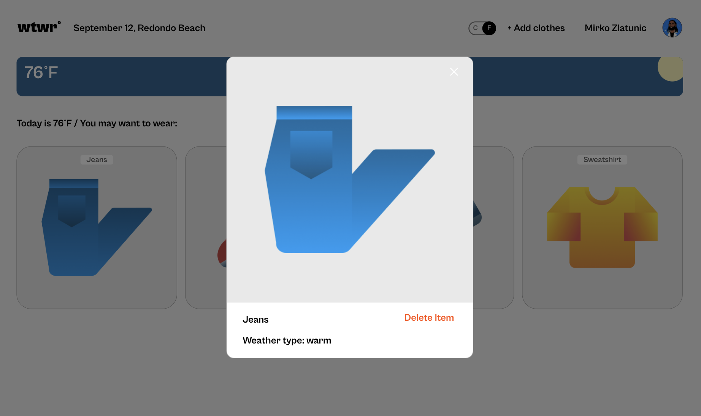
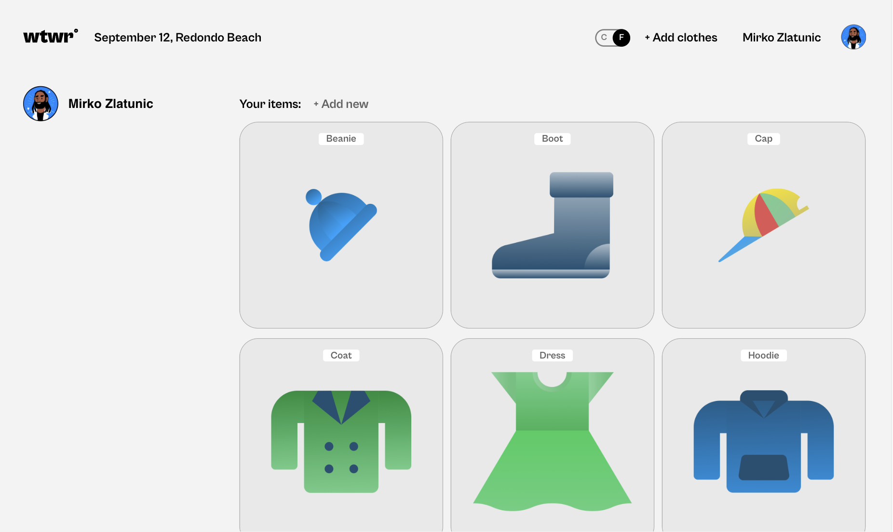

# WTWR (What to Wear?)

## About the project

The idea of the application is pretty simple - we make a call to an API, which then responds with the daily weather forecast. We collect the weather data, process it, and then based on the forecast, we recommend suitable clothing to the user.

## Screeshot

Home Page

Add new Card

Preview Card

Profile Page

## Figma

- [Link to the project on Figma](https://www.figma.com/file/dQLJwEKasIdspciJAJrCaf/Sprint-11_-WTWR?node-id=311%3A433&mode=dev)

## Technologies

- HTML
- CSS
- Figma
- BEM
- JavaScript
- Git
- JSON
- Webpack
- GitHub
- Fetch API
- React

## Backend Repository Link:

- [Backend Repository Link](https://github.com/mirkozlatunic/se_project_express)

# GitHub Page

- [Link to the Github Page](https://mirkozlatunic.github.io/se_project_react/)

**Created By [Mirko Zlatunic](https://github.com/mirkozlatunic)**
