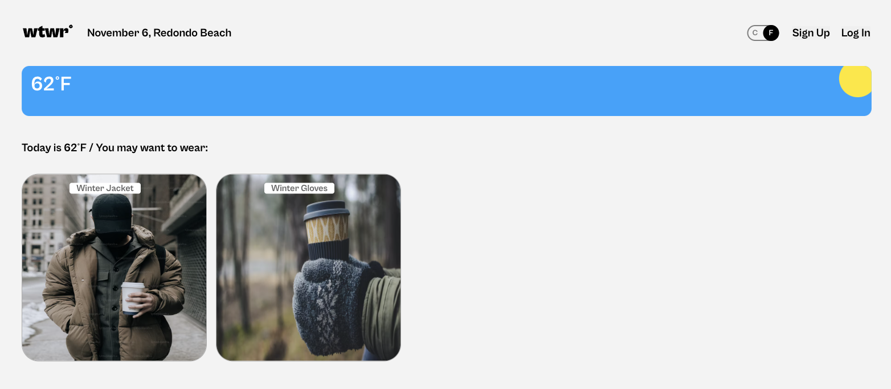
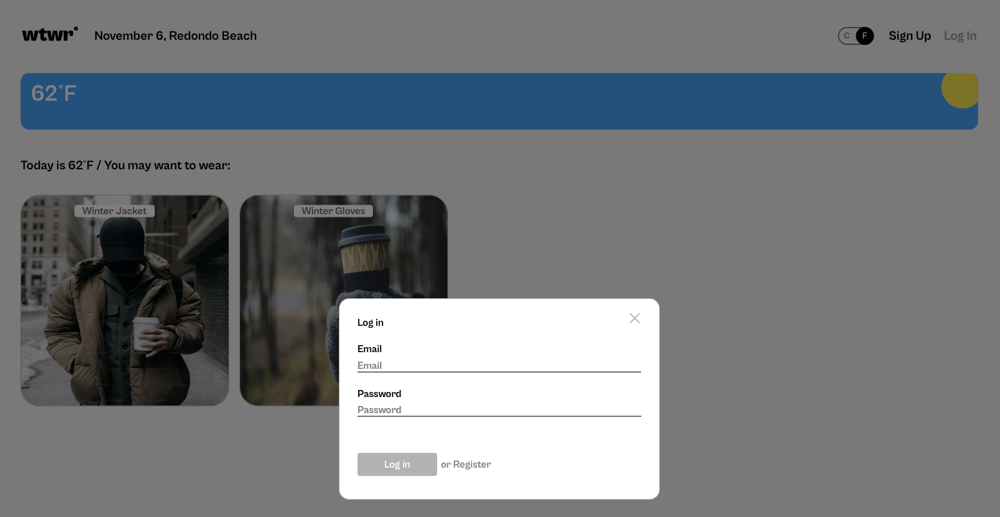
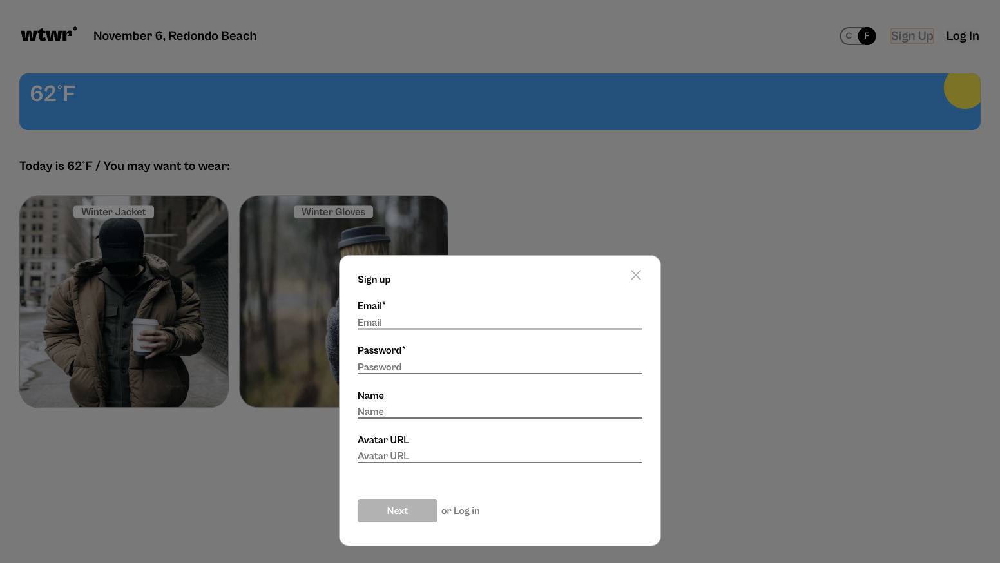
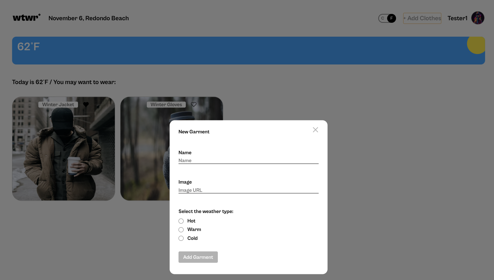
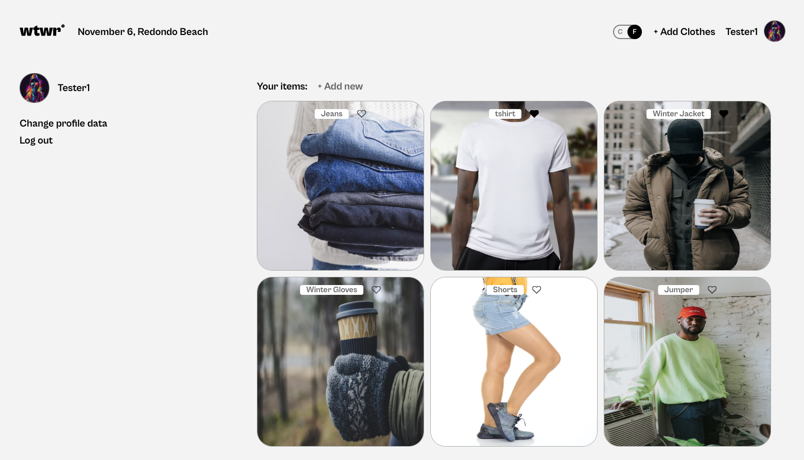
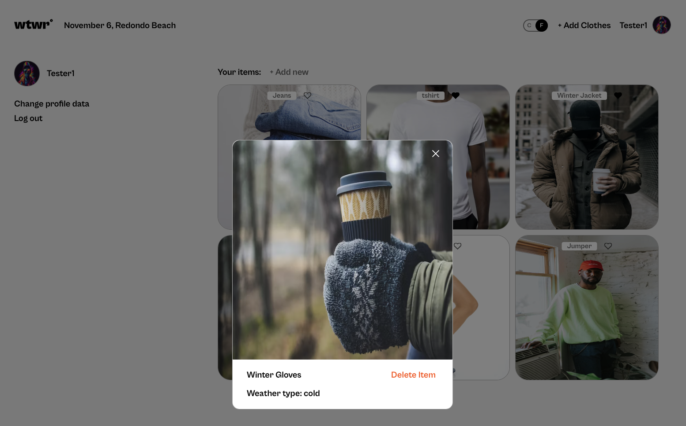
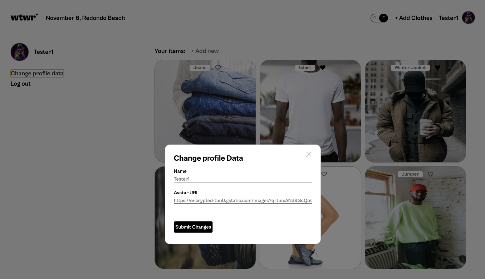

# WTWR (What to Wear?)

## About the Project

WTWR is a weather-based clothing recommendation app. It fetches your local weather forecast from the OpenWeather API, processes the temperature data, and recommends suitable clothing from your personal wardrobe. Users can create an account, build a collection of clothing items, like their favourites, and get outfit suggestions based on current conditions.

## Features

- Live weather data fetched from the OpenWeather API
- Temperature display in Fahrenheit or Celsius (toggle in the header)
- Browse clothing recommendations matched to the current weather
- User authentication — register, log in, and log out
- Add clothing items with a name, image URL, and weather category
- Like and unlike clothing items
- Edit your profile name and avatar
- Protected profile page — only accessible when logged in

## Screenshots

**Home Page**


**Login**


**Sign Up**


**Add a Clothing Item (Home Page)**


**Profile Page**


**Item Preview**


**Edit Profile**


## Getting Started

### Prerequisites

- Node.js (v16 or higher)
- npm
- A running instance of the [backend server](https://github.com/mirkozlatunic/se_project_express)
- An OpenWeather API key

### Installation

1. Clone the repository:
   ```bash
   git clone https://github.com/mirkozlatunic/se_project_react.git
   cd se_project_react
   ```

2. Install dependencies:
   ```bash
   npm install
   ```

3. Create a `.env` file in the project root and add your OpenWeather API key:
   ```
   REACT_APP_WEATHER_API_KEY=your_api_key_here
   ```

4. Start the development server:
   ```bash
   npm start
   ```

The app will open at `http://localhost:3000`. It connects to the backend at `http://localhost:3001` in development mode.

## Technologies

- React 18
- React Router v5
- Context API (global state management)
- JavaScript (ES6+)
- HTML & CSS (BEM methodology)
- Fetch API
- OpenWeather API
- Webpack (via Create React App)
- Git & GitHub

## Backend

The backend handles user authentication, clothing item storage, and likes.

- [Backend Repository](https://github.com/mirkozlatunic/se_project_express)

## Design

- [Figma Design File](https://www.figma.com/file/dQLJwEKasIdspciJAJrCaf/Sprint-11_-WTWR?node-id=311%3A433&mode=dev)

## Planned Improvements

- [x] Center-align clothing cards on the Home Page
- [ ] Public domain setup for broader access
- [x] Dynamic weather card image based on current weather conditions
- [x] Allow users to change their location region from the header

---

**Created by [Mirko Zlatunic](https://github.com/mirkozlatunic)**
